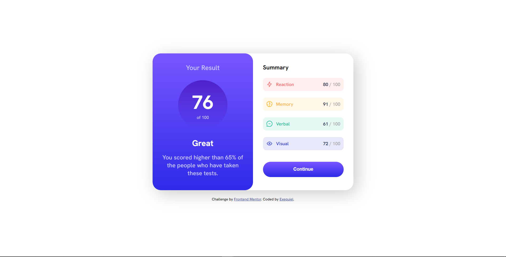
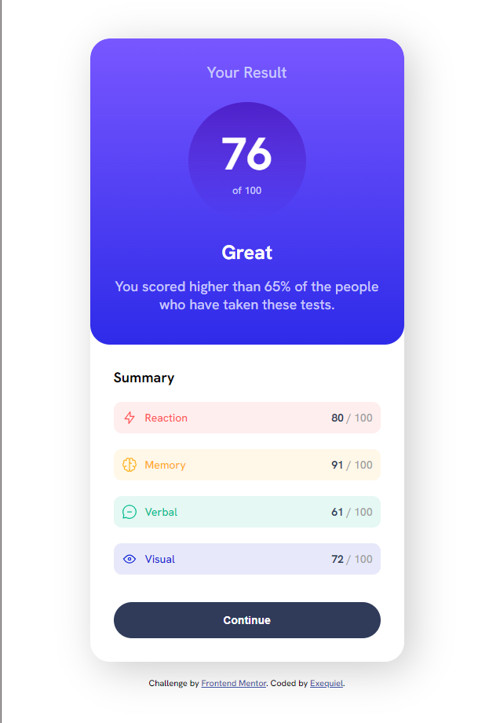

# Frontend Mentor - Results summary component solution

This is a solution to the [Results summary component challenge on Frontend Mentor](https://www.frontendmentor.io/challenges/results-summary-component-CE_K6s0maV). Frontend Mentor challenges help you improve your coding skills by building realistic projects.

## Table of contents

- [Overview](#overview)
  - [The challenge](#the-challenge)
  - [Screenshot](#screenshot)
  - [Links](#links)
- [My process](#my-process)
  - [Built with](#built-with)
- [Author](#author)

## Overview

### The challenge

Users should be able to:

- View the optimal layout for the interface depending on their device's screen size
- See hover and focus states for all interactive elements on the page

### Screenshot

### Links

- Solution URL: [https://github.com/quielLovesLasagna/results-summary-component](https://github.com/quielLovesLasagna/results-summary-component)
- Live Site URL: [https://quiel-results-summary-component.netlify.app/](https://quiel-results-summary-component.netlify.app/)

## My process

> I encountered a problem when I implemented the button's hover state. The transition property does not work at all (?) and flickers when I hover out from the button.
> Edit: I found a quick solution for transitioning gradients, [check this out](https://css-tricks.com/transitioning-gradients/?fbclid=IwAR2zU4sbRHEpr0GKOiKsRcF1kLfUrMBRauKjvdaMsAJOb0Am6rkSV4nqzEA)

### Built with

- HTML5
- CSS3

## Author

- Website - [quielLovesLasagna](https://github.com/quielLovesLasagna)
- Frontend Mentor - [@quielLovesLasagna](https://www.frontendmentor.io/profile/quielLovesLasagna)
